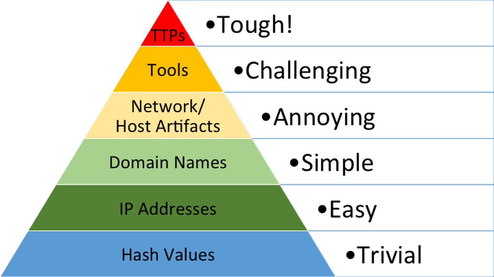

# Cyber Defense Frameworks

  - [Pyramid of Pain](#pyramid-of-pain)
  - [Cyber Kill Chain](#cyber-kill-chain)
  - [Unified Kill Chain](#unified-kill-chain)

*See also:* [*The CIA Triad*](#Cia-Triad.md)
## Pyramid of Pain
The pyramid of pain is a framework which describes the impact an indicator of compromise may have on the adversary when denied by a Blue Team.

There are 6 indicators.


**1. Hash values**

SHA1, MD5, or other similar hashes that correspond to specific suspicious or malicious files. Hash values are often used to provide unique references to specific samples of malware or to files involved in an intrusion.

**2. IP addresses**

As the name suggests, but also includes netblocks.

**3. Domain names**

A domain name itself, or sub domains.

**4a. Network Artifacts**

Adversaries’ network activities that are observable. Typical examples include URI patterns, C2 information embedded in network protocols, distinctive HTTP User-Agent, or SMTP Mailer values, etc.

**4b. Host Artifacts**

Observables caused by adversary activities on one or more of your hosts, such as registry keys or values known to be created by specific pieces of malware, files, or directories.

**5. Tools**

Software used by attackers to accomplish their mission. This includes utilities designed to create malicious documents for spear phishing, backdoors used to establish C2 or password crackers, or other host-based utilities

**6. Tactics, Techniques and Procedures (TTPs)**

How the adversary goes about accomplishing their mission, from reconnaissance all the way through data exfiltration and at every step in between.

*src: [What is the pyramid of pain?](https://www.attackiq.com/glossary/pyramid-of-pain/)*

## Cyber Kill Chain
The Cyber Kill Chain framework is designed for identification and prevention of the network intrusions. The framework defines the steps used by adversaries or malicious actors in cyberspace. To succeed, an adversary needs to go through all phases of the Kill Chain.

There are generally 7 steps in the Cyber Kill Chain:


**1. Reconnaissance**

Reconnaissance is discovering and collecting information on the system and the victim. The reconnaissance phase is the planning phase for the adversaries *e.g. OSINT*

combines malware and exploit into a deliverable payload. 

**2. Weaponization**

This is the process of combining malware and an exploit into a deliverable payload using the information found during the reconaissance phase *e.g. creating a malicious MS Word macro*

**3. Delivery**

Te method for transmitting the payload or the malware. For the malware to reach the machine of a victim, the adversary must deliver the malware to the victim. This is often done remotely using (spear)phishing but in some cases require physical delivery *e.g. distributing malicious USB sticks*. 


**4. Exploitation**

The actual misuse of a service/person/system that results in the access to said service, person or system. Examples of this are: 
1. The victim triggers the exploit by opening the email attachment or clicking on a malicious link.
2. Using a [zero-day exploit](https://www.ibm.com/topics/zero-day).
3. Exploit software, hardware, or even human vulnerabilities. 
4. An attacker triggers the exploit for server-based vulnerabilities. 

**5. Installation**

Once the attacker gets access to the system, he would want to reaccess the system if he loses the connection to it or if he got detected and got the initial access removed, or if the system is later patched. He will no longer have access to it. That is when the attacker needs to **install a persistent backdoor.** A persistent backdoor will let the attacker access the system he compromised in the past. 

**6. Command & Control**

After a persistent backdoor has been installed the attacker will need to communicate with the victim's machine. For this the attack will set up a Command and Control server (a.k.a. C2, C&C). 

The compromised endpoint would communicate with an external server set up by an attacker to establish a command & control channel. After establishing the connection,  the attacker has full control of the victim's machine. Until recently, IRC (Internet Relay Chat) was the traditional C2 channel used by attackers. This is no longer the case, as modern security solutions can easily detect malicious IRC traffic. 

The most common C2 channels used by adversaries nowadays:

- The protocols HTTP on port 80 and HTTPS on port 443 - this type of beaconing blends the malicious traffic with the legitimate traffic and can help the attacker evade firewalls.  
- DNS (Domain Name Server). The infected machine makes constant DNS requests to the DNS server that belongs to an attacker, this type of C2 communication is also known as DNS Tunneling.


**7. Actions on Objectives (Exfiltration)**

During this last phase of the attack, the adversary aims to reach their initial objectives. Often this includes deleting or exfiltrating data from the machine to the C2 server. 

With hands-on keyboard access, the attacker can achieve the following: 

- Collect the credentials from users.
- Perform privilege escalation (gaining elevated access like domain administrator access from a workstation by exploiting the misconfiguration).
- Internal reconnaissance (for example, an attacker gets to interact with internal software to find its vulnerabilities).
- Lateral movement through the company's environment.
- Collect and exfiltrate sensitive data.
- Deleting the backups and shadow copies. Shadow Copy is a Microsoft technology that can create backup copies, snapshots of computer files, or volumes. 
- Overwrite or corrupt data.

*src: [Tryhackme](https://tryhackme.com/r/room/cyberkillchainzmt)*
## Unified Kill Chain
The UKC aims to complement (not compete) with other cybersecurity kill chain frameworks such as Lockheed Martin’s and MITRE’s ATT&CK.

The UKC states that there are 18 phases to an attack: Everything from reconnaissance to data exfiltration and understanding an attacker's motive. These phases have been grouped together in this room into a few areas of focus for brevity, which will be detailed in the remaining tasks.

Some large benefits of the UKC over traditional cybersecurity kill chain frameworks include the fact that it is modern and extremely detailed (reminder: it has 18 phases officially, whereas other frameworks may have a small handful)

The UKC can encourage threat modelling as the UKC framework helps identify potential attack surfaces and how these systems may be exploited.


The UKC consists of 3 main phases:
1. In (Initial Foothold)
    - [Reconaissance](#reconnaissance-mitre-tactic-ta0043)
    - [Social Engineering](#social-engineering-mitre-tactic-ta0001)
    - [Exploitation](#exploitation-mitre-tactic-ta0002)
    - [Persistence](#persistence-mitre-tactic-ta0003)
    - [Defense Evasion](#defence-evasion-mitre-tactic-ta0005)
    - [Command & Control](#command--control-mitre-tactic-ta0011)
    - [Pivoting](#pivoting-mitre-tactic-ta0008)
2. Through (Network Propagation)
    - [Pivoting](#pivoting-mitre-tactic-ta0008-1)
    - [Discovery](#discovery-mitre-tactic-ta0007)
    - [Privilege Escalation](#privilege-escalation-mitre-tactic-ta0004)
    - [Execution](#execution-mitre-tactic-ta0002)
    - [Credential Access](#credential-access-mitre-tactic-ta0006)
    - [Lateral Movement](#lateral-movement-mitre-tactic-ta0008)
3. Out (Action on Objectives)
    - [Collection](#collection-mitre-tactic-ta0009)
    - [Exfiltration](#exfiltration-mitre-tactic-ta0010)
    - [Impact](#impact-mitre-tactic-ta0040)
    - [Objectives](#objectives) 

### Phase 1: In


#### Reconnaissance (MITRE Tactic TA0043)

This phase of the UKC describes techniques that an adversary employs to gather information relating to their target. This can be achieved through means of passive and active reconnaissance. The information gathered during this phase is used all throughout the later stages of the UKC (such as the initial foothold).

Information gathered from this phase can include:

- Discovering what systems and services are running on the target, this is beneficial information in the weaponisation and exploitation phases of this section. 
- Finding contact lists or lists of employees that can be impersonated or used in either a social engineering or phishing attack.
- Looking for potential credentials that may be of use in later stages,  such as pivoting or initial access.
- Understanding the network topology and other networked systems can be used to pivot too. 
Weaponization (MITRE Tactic TA0001)

This phase of the UKC describes the adversary setting up the necessary infrastructure to perform the attack. For example, this could be setting up a command and control server, or a system capable of catching reverse shells and delivering payloads to the system.

#### Social Engineering (MITRE Tactic TA0001)

This phase of the UKC describes techniques that an adversary can employ to manipulate employees to perform actions that will aid in the adversaries attack. For example, a social engineering attack could include:

Getting a user to open a malicious attachment.
Impersonating a web page and having the user enter their credentials.
Calling or visiting the target and impersonating a user (for example, requesting a password reset) or being able to gain access to areas of a site that the attacker would not previously be capable of (for example, impersonating a utility engineer).

#### Exploitation (MITRE Tactic TA0002)

This phase of the UKC describes how an attacker takes advantage of weaknesses or vulnerabilities present in a system. The UKC defines "Exploitation" as abuse of vulnerabilities to perform code execution. For example:

Uploading and executing a reverse shell to a web application.
Interfering with an automated script on the system to execute code.
Abusing a web application vulnerability to execute code on the system it is running on.

#### Persistence (MITRE Tactic TA0003)

This phase of the UKC is rather short and simple. Specifically, this phase of the UKC describes the techniques an adversary uses to maintain access to a system they have gained an initial foothold on. For example:

Creating a service on the target system that will allow the attacker to regain access.
Adding the target system to a Command & Control server where commands can be executed remotely at any time.
Leaving other forms of backdoors that execute when a certain action occurs on the system (i.e. a reverse shell will execute when a system administrator logs in).

#### Defence Evasion (MITRE Tactic TA0005)

The "Defence Evasion" section of the UKC is one of the more valuable phases of the UKC. This phase specifically is used to understand the techniques an adversary uses to evade defensive measures put in place in the system or network. For example, this could be:

Web application firewalls.
Network firewalls.
Anti-virus systems on the target machine.
Intrusion detection systems.
This phase is valuable when analysing an attack as it helps form a response and better yet - gives the defensive team information on how they can improve their defence systems in the future.

#### Command & Control (MITRE Tactic TA0011)

The "Command & Control" phase of the UKC combines the efforts an adversary made during the "Weaponization" stage of the UKC to establish communications between the adversary and target system.

An adversary can establish command and control of a target system to achieve its action on objectives. For example, the adversary can:

Execute commands.
Steal data, credentials and other information.
Use the controlled server to pivot to other systems on the network.

#### Pivoting (MITRE Tactic TA0008)

"Pivoting" is the technique an adversary uses to reach other systems within a network that are not otherwise accessible (for example, they are not exposed to the internet). There are often many systems in a network that are not directly reachable and often contain valuable data or have weaker security.

For example, an adversary can gain access to a web server that is publically accessible to attack other systems that are within the same network (but are not accessible via the internet).

### Phase 2: Through


#### Pivoting (MITRE Tactic TA0008)

Once the attacker has access to the system, they would use it as their staging site and a tunnel between their command operations and the victim’s network. The system would also be used as the distribution point for all malware and backdoors at later stages.

#### Discovery (MITRE Tactic TA0007)

The adversary would uncover information about the system and the network it is connected to. Within this stage, the knowledge base would be built from the active user accounts, the permissions granted, applications and software in use, web browser activity, files, directories and network shares, and system configurations.

#### Privilege Escalation (MITRE Tactic TA0004)

Following their knowledge-gathering, the adversary would try to gain more prominent permissions within the pivot system. They would leverage the information on the accounts present with vulnerabilities and misconfigurations found to elevate their access to one of the following superior levels:

```bash
SYSTEM/ ROOT.
Local Administrator.
A user account with Admin-like access.
A user account with specific access or functions.
```

#### Execution (MITRE Tactic TA0002)

This is where they deploy their malicious code using the pivot system as their host. Remote trojans, C2 scripts, malicious links and scheduled tasks are deployed and created to facilitate a recurring presence on the system and uphold their persistence.

#### Credential Access (MITRE Tactic TA0006)

Working hand in hand with the Privilege Escalation stage, the adversary would attempt to steal account names and passwords through various methods, including keylogging and credential dumping. This makes them harder to detect during their attack as they would be using legitimate credentials.

#### Lateral Movement (MITRE Tactic TA0008)

With the credentials and elevated privileges, the adversary would seek to move through the network and jump onto other targeted systems to achieve their primary objective. The stealthier the technique used, the better.

### Phase 3: Out

This phase wraps up the journey of an adversary’s attack on an environment, where they have critical asset access and can fulfil their attack goals. These goals are usually geared toward compromising the confidentiality, integrity and availability (CIA) triad.


The tactics to be deployed by an attacker would include:

#### Collection MITRE Tactic (TA0009)

After all the hunting for access and assets, the adversary will be seeking to gather all the valuable data of interest. This, in turn, compromises the confidentiality of the data and would lead to the next attack stage – Exfiltration. The main target sources include drives, browsers, audio, video and email.

#### Exfiltration (MITRE Tactic TA0010)

To elevate their compromise, the adversary would seek to steal data, which would be packaged using encryption measures and compression to avoid any detection. The C2 channel and tunnel deployed in the earlier phases will come in handy during this process.

#### Impact (MITRE Tactic TA0040)

If the adversary seeks to compromise the integrity and availability of the data assets, they would manipulate, interrupt or destroy these assets. The goal would be to disrupt business and operational processes and may involve removing account access, disk wipes, and data encryption such as ransomware, defacement and denial of service (DoS) attacks.

#### Objectives

With all the power and access to the systems and network, the adversary would seek to achieve their strategic goal for the attack.

For example, if the attack was financially motivated, they may seek to encrypt files and systems with ransomware and ask for payment to release the data. In other instances, the attacker may seek to damage the reputation of the business, and they would release private and confidential information to the public.

*src: [Tryhackme](https://tryhackme.com/r/room/unifiedkillchain)*

