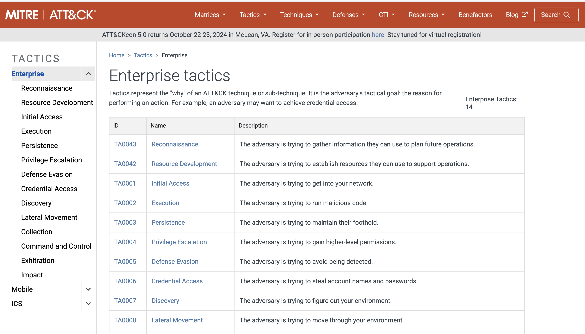
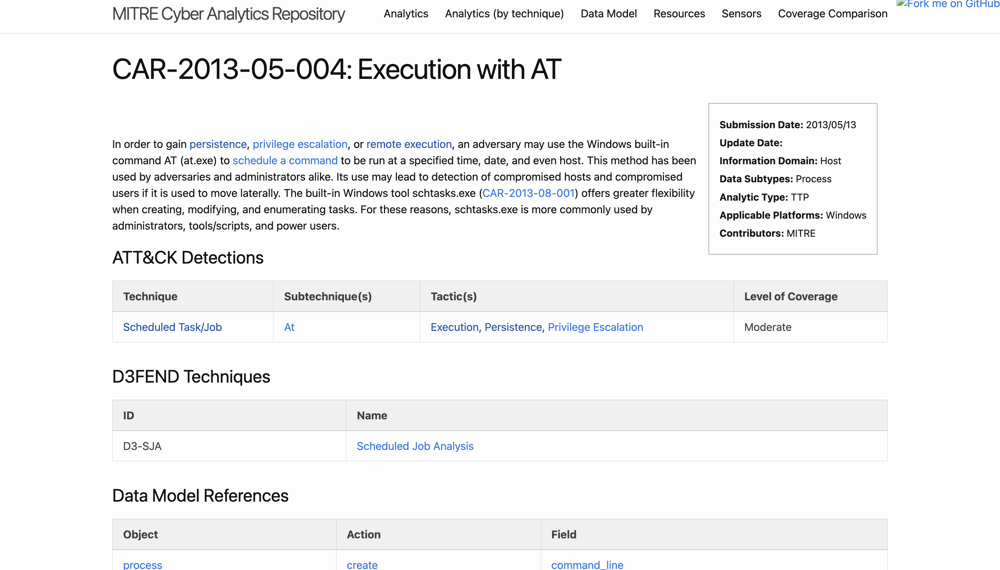
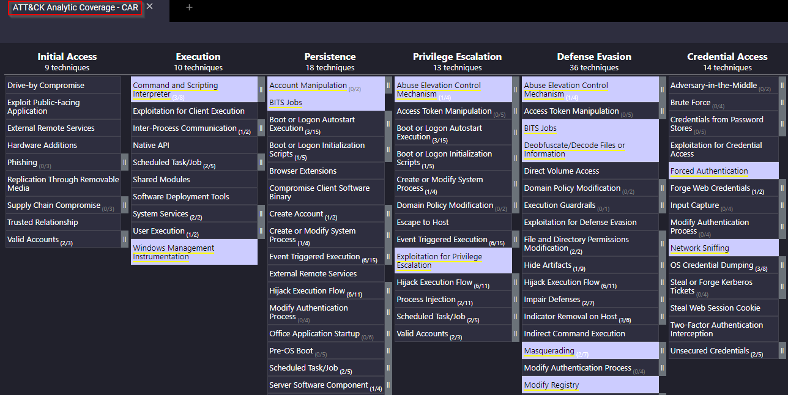
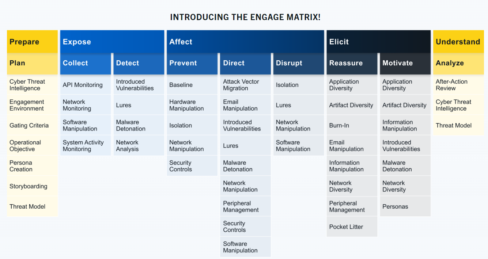

#  MITRE

MITRE is a non-profit, US based organization that amongst other fields, conducts research and projects in the field of cybersecurity. While the ATT&CK® framework is a relatively well known one, there are several other projects MITRE has conducted such as:

- [**ATT&CK®**](#attck)(Adversarial Tactics, Techniques, and Common Knowledge) Framework

- [**CAR**](#cyber-analytics-repository) (Cyber Analytics Repository) Knowledge Base

- [**ENGAGE**](#engage)

- [**D3FEND**](#d3fend) (Detection, Denial, and Disruption Framework Empowering Network Defense)

- [**AEP**](#attck-emulation-plans) (ATT&CK Emulation Plans)

## ATT&CK®

MITRE ATT&CK® is a globally-accessible knowledge base of adversary tactics and techniques based on real-world observations.

## Cyber Analytics Repository
 CAR is a knowledge base of analytics developed by MITRE based on the MITRE ATT&CK® adversary model. CAR defines a data model that is leveraged in its pseudocode representations but also includes implementations directly targeted at specific tools (e.g., Splunk, EQL) in its analytics.

 

 

## ENGAGE
MITRE Engage is a framework for planning and discussing adversary engagement operations that empowers you to engage your adversaries and achieve your cybersecurity goals.

MITRE Engage is considered an Adversary Engagement Approach. This is accomplished by the implementation of **Cyber Denial** and **Cyber Deception**. 

With **Cyber Denial** we prevent the adversary's ability to conduct their operations and with **Cyber Deception** we intentionally plant artifacts to mislead the adversary. 

The Engage website provides a starter kit to get you 'started' with the Adversary Engagement Approach. The starter kit is a collection of whitepapers and PDFs explaining various checklists, methodologies, and processes to get you started. 

Let's quickly explain each of these categories based on the information on the Engage website.
- **Prepare** the set of operational actions that will lead to your desired outcome (input)
- **Expose** adversaries when they trigger your deployed deception activities 
- **Affect** adversaries by performing actions that will have a negative impact on their operations
- **Elicit** information by observing the adversary and learn more about their modus operandi (TTPs)
Understand the outcomes of the operational actions (output) 

### Resources
[ENGAGE Handbook](https://engage.mitre.org/wp-content/uploads/2022/04/EngageHandbook-v1.0.pdf)

[ENGAGE Matrix Explorer](https://engage.mitre.org/matrix)

## D3FEND
[D3FEND](https://d3fend.mitre.org/) stands for Detection, Denial, and Disruption Framework Empowering Network Defense and acts as a knowledge graph of cybersecurity countermeasures.

## ATT&CK Emulation Plans
Under MITRE ENGENUITY, there exist CTID, the Adversary Emulation Library, and ATT&CK® Emulation Plans. 

MITRE formed an organization named The Center of Threat-Informed Defense (CTID). This organization consists of various companies and vendors from around the globe. Their objective is to conduct research on cyber threats and their TTPs and share this research to improve cyber defense for all. 
