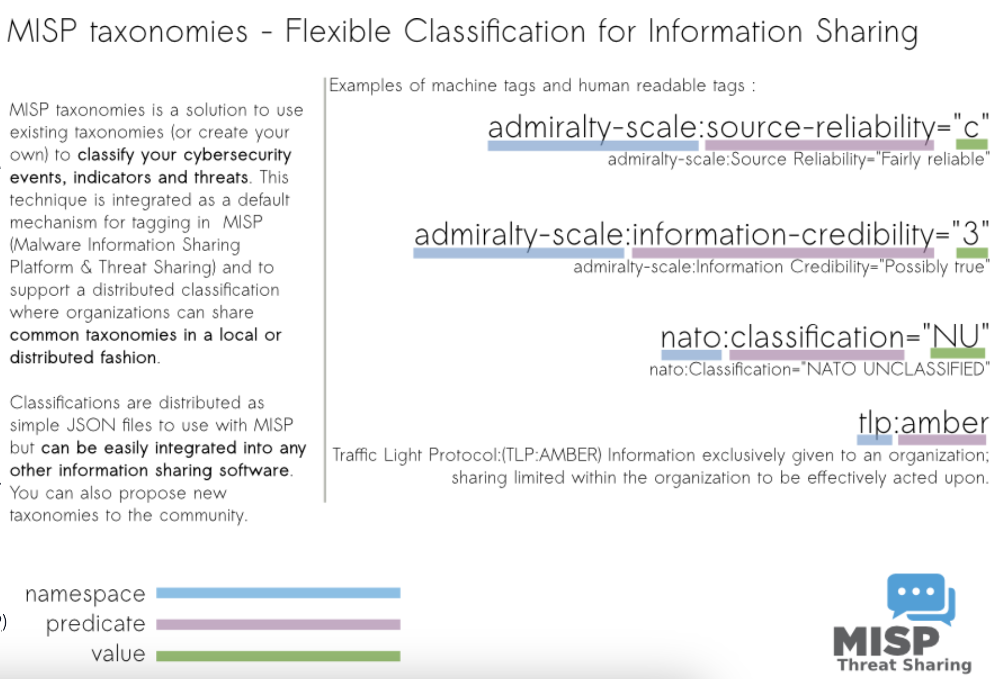

# MISP 

MISP (Malware Information Sharing Platform) is an open-source threat information platform that **facilitates the collection**, **storage** and **distribution** of **threat intelligence** and **Indicators of Compromise (IOCs)** related to malware, cyber attacks, financial fraud or any intelligence within a community of trusted members. 

Information sharing follows a distributed (decentralized) model, with supported closed, semi-private, and open communities (public). 

Additionally, the threat information can be distributed and consumed by Network Intrusion Detection Systems (NIDS), log analysis tools and Security Information and Event Management Systems (SIEM).

## MISP is useful in the following cases

**Malware Reverse Engineering**: Sharing of malware indicators to understand how different malware families function.

**Security Investigations:** Searching, validating and using indicators in investigating security breaches.

**Intelligence Analysis:** Gathering information about adversary groups and their capabilities.

**Law Enforcement:** Using Indicators to support forensic investigations.

**Risk Analysis:** Researching new threats, their likelihood and occurrences.

**Fraud Analysis:** Sharing of financial indicators to detect financial fraud.

## MISP provides various core functionalities

**IOC database:** This allows for the storage of technical and non-technical information about malware samples, incidents, attackers and intelligence.

**Automatic Correlation:** Identification of relationships between attributes and indicators from malware, attack campaigns or analysis.

**Data Sharing:** This allows for sharing of information using different models of distributions and among different MISP instances.

**Import & Export Features:** This allows the import and export of events in different formats to integrate other systems such as NIDS, HIDS, and OpenIOC.

**Event Graph:** Showcases the relationships between objects and attributes identified from events.

**API support:** Supports integration with own systems to fetch and export events and intelligence.

## Using MISP

### Event Management
The Event Actions tab is where you, as an analyst, will create all malware investigation correlations by providing descriptions and attributes associated with the investigation. Splitting the process into three significant phases, we have: 
1. Event Creation
2. Populating events with attributes and attachments.
3. Publishing.

## Feeds & Taxonomies
### Feeds
Feeds are resources that contain indicators that can be imported into MISP and provide attributed information about security events. These feeds provide analysts and organisations with continuously updated information on threats and adversaries and aid in their proactive defence against attacks.

MISP Feeds provide a way to:

- Exchange threat information.
- Preview events along with associated attributes and objects.
- Select and import events to your instance.
- Correlate attributes identified between events and feeds.

Feeds are enabled and managed by the Site Admin for the analysts 
to obtain information on events and indicators. 

### Taxonomies

A taxonomy is a means of classifying information based on standard features or attributes. On MISP, taxonomies are used to categorise events, indicators and threat actors based on tags that identify them.

Analysts can use taxonomies to:

- Set events for further processing by external tools such as VirusTotal.
- Ensure events are classified appropriately before the Organisation Admin publishes them.
- Enrich intrusion detection systems' export values with tags that fit specific deployments.

Taxonomies are expressed in machine tags, which comprise three vital parts:

- **Namespace:** Defines the tag's property to be used.
- **Predicate:** Specifies the property attached to the data.
- **Value:** Numerical or text details to map the property.

Taxonomies are listed under the Event Actions tab. The site admin can enable relevant taxonomies.

### Tagging

Information from feeds and taxonomies, tags can be placed on events and attributes to identify them based on the indicators or threats identified correctly. Tagging allows for effective sharing of threat information between users, communities and other organisations using MISP to identify various threats.

#### Event vs Attribute Tags
Tags can be added to an **event** and **attributes**. Tags are also inheritable when set. It is recommended to set tags on the entire event and only include tags on attributes when they are an exception from what the event indicates. This will provide a more fine-grained analysis.

#### The Minimal Subset of Tags

The following tags can be considered a must-have to provide a well-defined event for distribution:

**Traffic Light Protocol:** Provides a colour schema to guide how intelligence can be shared.

**Confidence:** Provides an indication as to whether or not the data being shared is of high quality and has been vetted so that it can be trusted to be good for immediate usage.

**Origin:** Describes the source of information and whether it was from automation or manual investigation.

**Permissible Actions Protocol:** An advanced classification that indicates how the data can be used to search for compromises within the organisation.